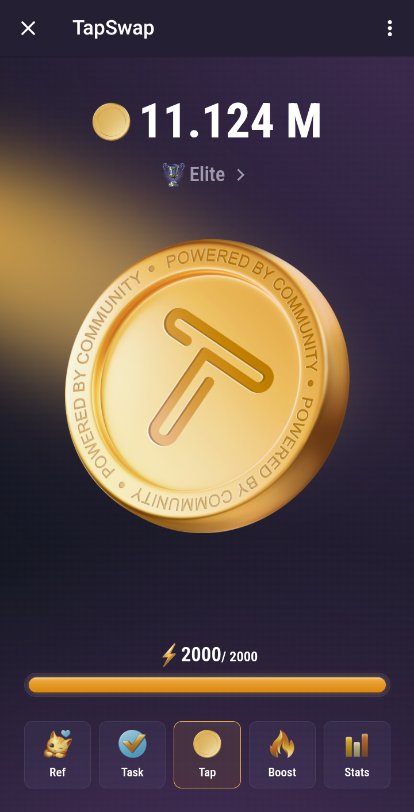
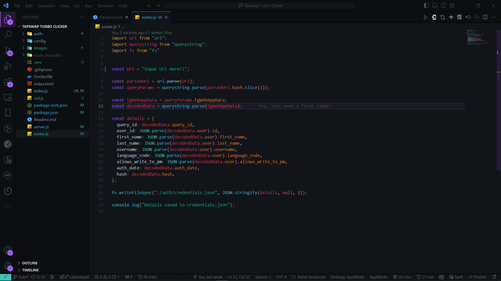
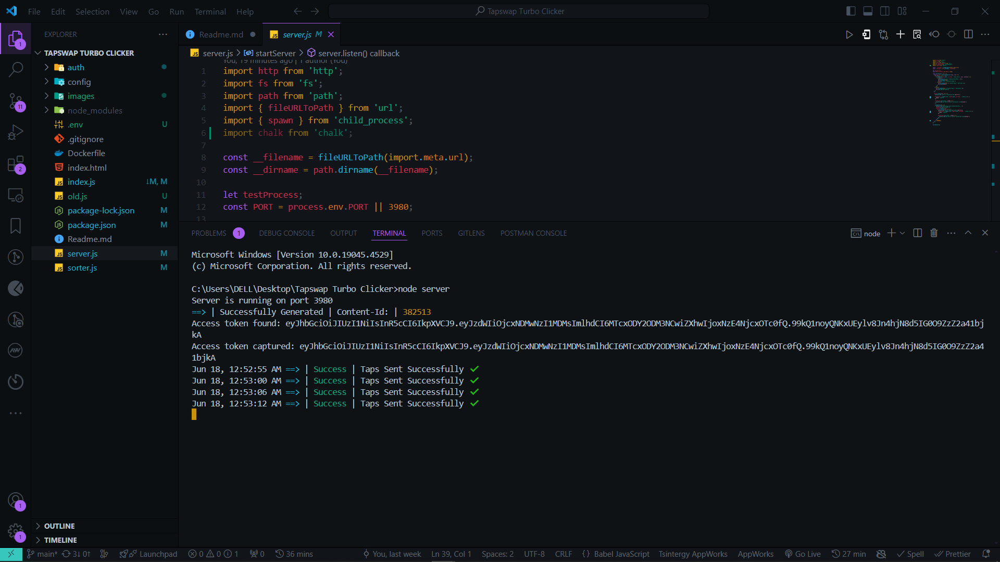

Follow Me On => [](https://github.com/WackyDawg)
[](https://twitter.com/JNwadinobi26328)
[](https://www.linkedin.com/in/julian-nwadinobi-xsd)
# TapSwap 🗲Auto Clicker V2.0

Welcome to the TapSwap 🗲 Auto Clicker repository. This script automates the clicking process in the TapSwap game, allowing you to maximize your earnings by running continuously 24/7. Unlike the manual tapping required in the game, this script ensures every second is utilized efficiently.

## Features

- Automates the tap-to-earn process in the TapSwap game.
- **Periodic Taps Sending:** Sends taps to the server at regular intervals.
- **Boost Application:** Periodically applies boosts to increase the number of taps for a short duration.
- Runs continuously 24/7 to maximize earnings.
- Configurable click intervals
- Runs only 1  Accounts

## Prerequisites

- Node.js
- npm (Node Package Manager)
- Telegram(Android
-  Render Account : To deploy and run this code 24/7 without consuming your power and internet connection, you will need a [Render](https://render.com/) account.
- Cron-job.org Account : To run cron job on your server so that it does not go inactive.

## Installation

1. Clone the repository:

   ```sh
   git clone https://github.com/WackyDawg/Tapswap-Clicker-v2.0.git
   cd Tapswap-Clicker-v2.0
   ```
2. Install the required packages:

   ```sh
   npm install
   ```
3. Create a `.env` file in the root directory and add the following content:

   ```env
   PORT=3000
   ```
4. Open Telegram on your Android device, navigate to the TapSwapBot, and click the "Start" button. Please note that this procedure is specifically for Android devices, as it does not work on iOS devices.
5. Turn off your mobile data or Wi-Fi connection. Next, click the three dots in the upper-right corner of the screen and select "Reload Page." Once the page reloads, copy the full URL that appears
6. Paste the copied URL into the `Url` field in the `sorter.js` file and run it using

   ```
   node sorter
   ```

   
7. You should get this response: "Details saved to credentials.json." Now go to the `auth/credentials.json` file that was just generated and use the details to set up `credentials.js` e.g.

   ```
   {
     "query_id": "XYZ123ArAwAAAPcLYCtmJT0h",
     "user_id": 1234567890,
     "first_name": "John",
     "last_name": "Doe",
     "language_code": "en",
     "allows_write_to_pm": true,
     "auth_date": "1620000000",
     "hash": "abcdef1234567890abcdef1234567890abcdef1234567890abcdef1234567890"
   }

   ```
8. Now go over to the `config/config.js` and configure  your settings for managing tap actions and cycles within the application below Below are the details of each property in the configuration:

   ```
   const tapsConfig = {
       "coinsPerCycle": "22",      // Coins earned per 2 taps
       "numberOfTaps": "2",        // Number of taps to send in each cycle
       "cycleDuration": "5",       // Duration (in seconds) within which the taps should be sent
       "boostInterval": 9600000,   // Time interval (in milliseconds) between activating boosts
       "energyThreshold": 2000     // Energy limit, for example, 1000, 2000, or 2500
   }

   export default tapsConfig;

   ```
9. 🎉 Voila! Now you can run the script. 🚀 Simply start up the script using `node server.js` so that we can restart the index every 30 minutes to get a new access token.

## Usage

## 1. Start the server:

```sh
node server.js  
```



2. The frontend server will start running on `http://localhost:3000`. Note that this frontend was created so we could send ping request with our cron job

## Follow for More Amazing Projects

If you enjoyed this project and want to stay updated on more amazing projects, follow me on [GitHub](https://github.com/WackyDawg) and [Twitter](https://twitter.com/JNwadinobi26328). Your support means a lot and keeps me motivated to create more cool stuff! 🌟
